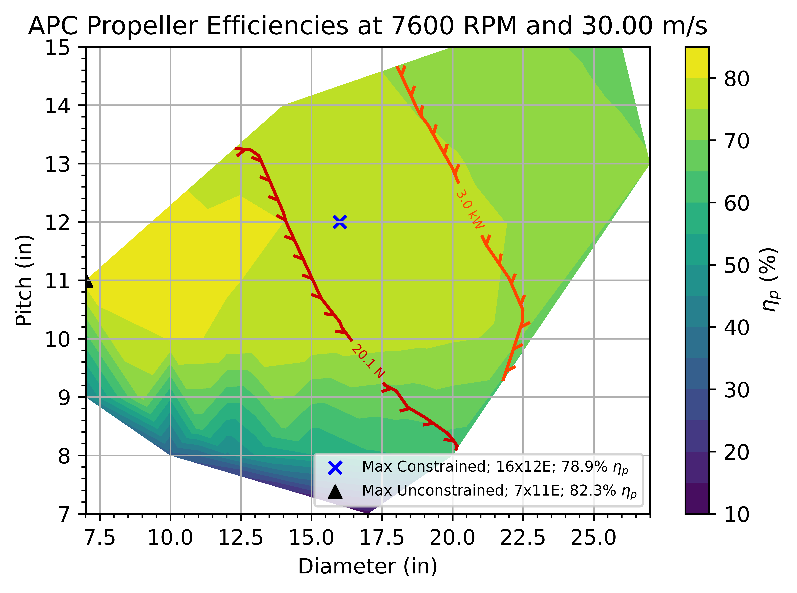
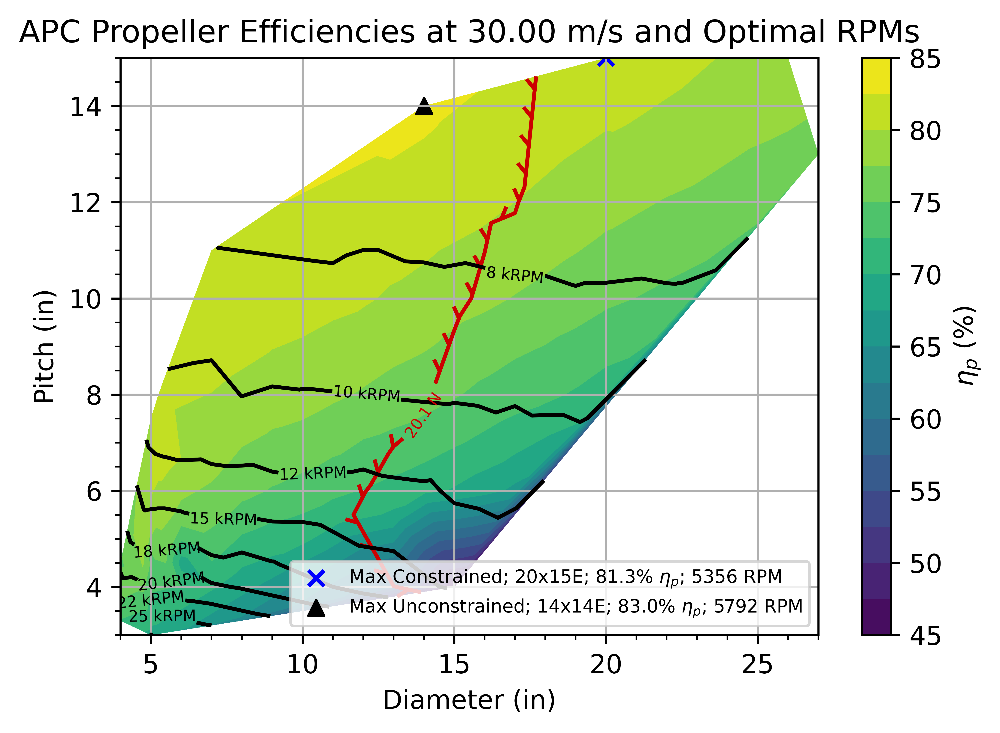

# To use
1. Download the entire repo
2. Unzip 
3. Open USEME.py (numpy, matplotlib, and scipy need to be installed in the Python environment)
4. Modify  $V_{\infty}$ (freestream velocity in $\frac{m}{s}$),
           RPM,
           $S_w$ (wing area in $m^2$),
           $C_D$ (drag coefficient),
           and Plimit (mechanical power limit in $W$)
6. Enjoy!

Example fixed RPM, Vinf efficiency map

Example fixed Vinf, optimal RPM efficiency map

