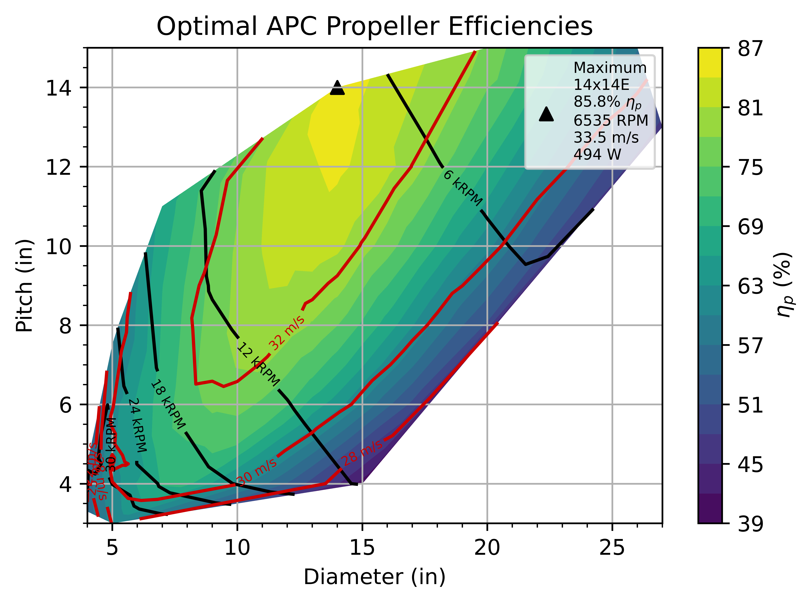

## Usage
1. Download the entire repo
2. Unzip 
3. Open USEME.py (numpy, matplotlib, and scipy need to be installed in the Python environment)
4. Modify  $V_{\infty}$ (freestream velocity in $\frac{m}{s}$),
           RPM,
           $S_w$ (wing area in $m^2$),
           $C_D$ (drag coefficient),
           and Plimit (mechanical power limit in $W$)
6. Enjoy!

## Sample Plots
Basic fixed RPM, Vinf efficiency map (Sw = 0.6 $m^2$, CD = 0.03, Pmax < 500 W)

Optimized RPM, Vinf efficiency map (Sw = 0.6 $m^2$, CD = 0.03, Pmax < 500 W)

